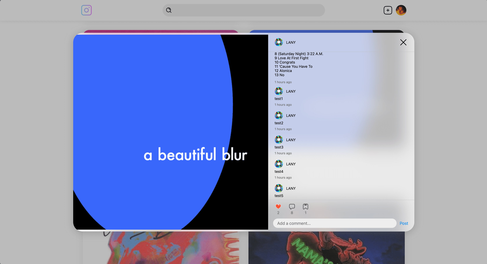

# Mini Instagram

## Getting Started Locally

❗️This monorepo project is managed by `pnpm`, so you must install `pnpm` first.

- In the root folder, run `pnpm i`.
- Then run `pnpm dev` and the backend app Strapi will run at `1337` port, frontend app Vue will run at `5173` port.
- The Strapi admin account and password are abc@abc.com | Qwer1234.

## Highlight

- **Latest Vue system**: Built with TypeScript, Composition API, and Pinia.
- **Grid Layout**: Instead of using flex layout, this project only utilizes grid layout.
- **Smooth Scrolling**: The homepage features a smooth scrolling experience with `scroll-snap`.

## Key Pages

- **Login Page**: Register or login here.
  
- **Home Page**: Browse all posts here, and click a post image to see the full description and comments.
  
  
- **Profile Page**: View your published, liked, and saved posts.
  
- **Profile Edit Page**: Edit your personal information.
  

## List of Testing Users

All passwords are the same: `qwe123`.

- `thisislany@test.com`
- `teddysphotos@test.com`
- `fujiikaze@test.com`
- `rothbartbaron@test.com`

## More about pnpm

- If you want to add some packages at certain sub-package like vue-app, use `--filter` command, e.g. `pnpm add -F xxx`.
- If you want to run the front-end app only, use `pnpm -F mini-instagram-vue dev`.
